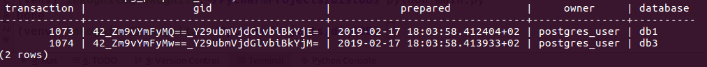

### 2PC in Python psycopg2

Basic showcase of using Two-Phase Transaction in Python3 `psycopg2` package.

`create_db.sql` contains queries to create the database and the user.

`main.py` contains the showcase example.

_If we do not commit or rollback a 2PC transaction, then it will wait:_

