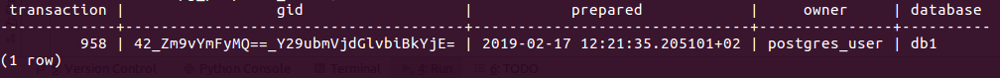

### 2PC in Python psycopg2

Due to strange implementation in the library the code looks a little
bit confusing. Nevertheless, it shows the usage of 2PC transaction.

`create_db.sql` contains queries to create the database and the user.

`main.py` contains the code for managing the database.

_If we do not commit or rollback a 2PC transaction, then it will wait:_
